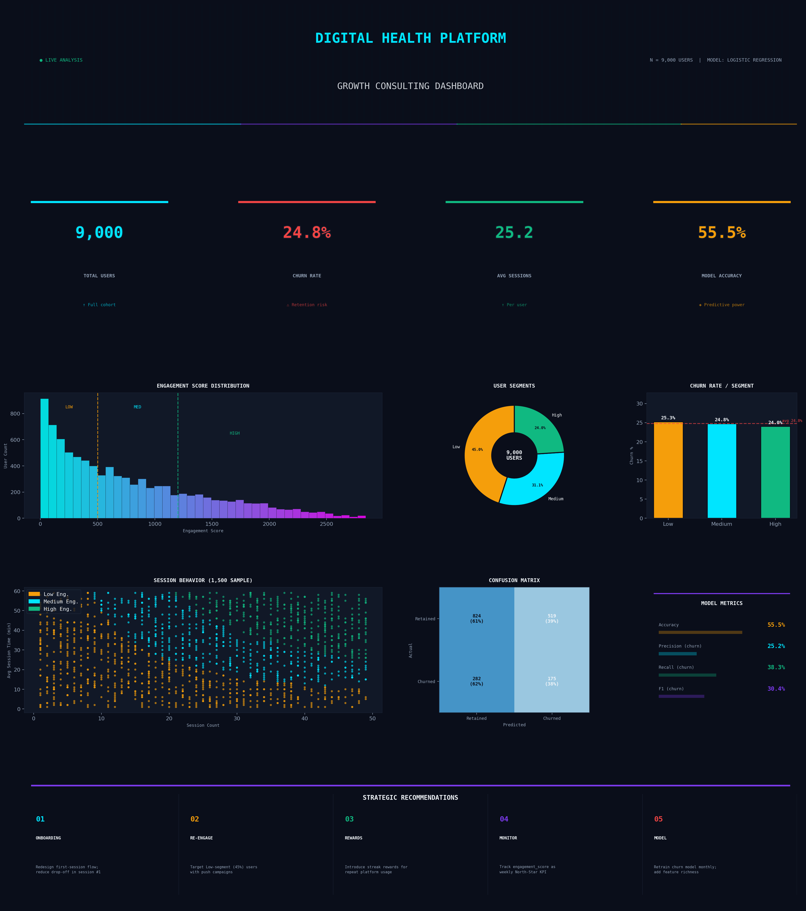

Digital Health Platform Growth Consulting

📋 Project Overview
This project delivers a full-stack consulting engagement for a digital health SaaS platform. Starting from raw app usage telemetry (9,000 users), the analysis spans data quality checks, feature engineering, user segmentation, churn prediction modelling, and actionable strategic recommendations.
The goal: understand why users leave and what can be done about it.

📦 Dataset
File: app_usage.csv
Rows: 9,000 users
Columns: 5 features
ColumnTypeDescriptionuser_idintUnique user identifierpatient_idintPatient reference IDsession_countintTotal app sessions (1–49)avg_session_timeintAverage session duration in minutes (1–59)dropped_outintChurn label: 1 = churned, 0 = retained
Class distribution: 75.2% retained · 24.8% churned (2,233 churned users)

⚙️ Feature Engineering
A composite engagement score was engineered to capture both usage breadth and depth:
pythondf['engagement_score'] = df['session_count'] * df['avg_session_time']
Why this works: A user with 40 sessions of 5 minutes each may be less engaged than one with 20 sessions of 40 minutes. Multiplying the two dimensions creates a single signal that captures total "time invested" in the platform.
Segmentation Thresholds
TierThresholdUsersShare🟡 Low Engagementscore < 5004,04945.0%🔵 Medium Engagement500 ≤ score < 1,2002,79531.1%🟢 High Engagementscore ≥ 1,2002,15624.0%

🤖 Churn Prediction Model
Architecture
Algorithm:   Logistic Regression (class_weight='balanced')
Split:       80% train / 20% test (random_state=42)
Features:    session_count, avg_session_time, engagement_score
Target:      dropped_out (binary)
Results
MetricRetained (0)Churned (1)OverallPrecision75%25%—Recall61%38%—F1-Score67%30%—Accuracy——55.6%
Confusion Matrix
                Predicted Retained   Predicted Churned
Actual Retained        824 (TN)           519 (FP)
Actual Churned         282 (FN)           175 (TP)

📊 Key Findings
1. Churn is Uniform Across All Segments

Most surprising result: churn rate is ~24–25% across Low, Medium, and High engagement segments.

SegmentChurn RateLow Engagement25.3%Medium Engagement24.8%High Engagement24.0%
This uniformity signals that churn is driven by platform-level factors (UX friction, value proposition gaps, feature discoverability) rather than individual usage behaviour.
2. Features Have Near-Zero Correlation with Churn
FeatureCorrelation with dropped_outsession_count-0.008avg_session_time+0.010engagement_score-0.005
All correlations are essentially zero — the current feature set cannot linearly predict churn. The 55.6% model accuracy barely exceeds a majority-class baseline (~75.2% for always predicting "retained"), though the balanced class weighting means it captures more true churn cases.
3. The Low-Engagement Segment is the Largest Growth Lever
4,049 users (45%) fall in the Low Engagement tier. Converting even 20% of these to Medium Engagement would significantly lift platform retention and LTV.

🚀 Strategic Recommendations
#InitiativePriorityTimeline01Onboarding Redesign — Reduce session-1 drop-off; guide users to core value within 3 sessions🔴 CriticalQ102Re-engagement Campaigns — Personalised push/email triggers for Low segment (4,049 users)🔴 CriticalQ103Gamified Rewards — Streaks, badges, milestones to drive repeat usage🟡 HighQ304KPI Monitoring — Track engagement_score as weekly North-Star metric🟡 HighQ205Model Enrichment — Collect richer features, retrain with XGBoost🟢 MediumQ3–Q4

⚠️ Limitations & Known Gaps
Data Gaps

❌ No demographic data (age, condition type, geography)
❌ No feature-level adoption (which platform features users engaged with)
❌ No time-series / longitudinal session data
❌ No support tickets, NPS scores, or qualitative signals
❌ No login-gap data (days between sessions)

Model Limitations

⚠️ 55.6% accuracy is weak — near-random for a balanced model
⚠️ All features have near-zero correlation with churn
⚠️ Logistic Regression cannot capture non-linear churn patterns
⚠️ Class imbalance (75/25) not fully addressed

